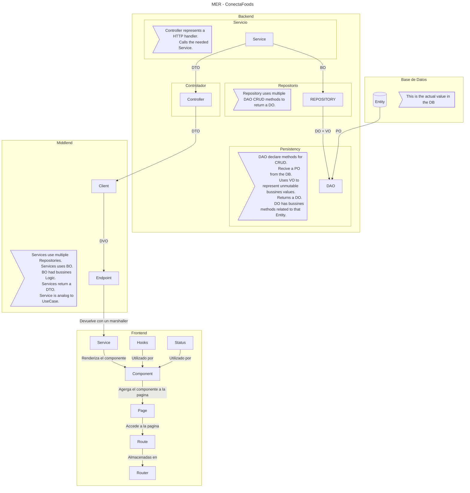

# Backend

```mermaid
---
title: MER - ConectaFoods
---
flowchart TB
    subgraph Base de Datos
        E[(Entity)]
        C1>"This is the actual value in the DB"]
    end
    subgraph Backend
        subgraph Persistency
            C2>"DAO declare methods for CRUD.
                Recive a PO from the DB.
                Uses VO to represent unmutable bussines values.
                Returns a DO.
                DO has bussines methods related to that Entity.  
            "]
            E -->|PO| DAO
        end
        subgraph Repositorio
            C3>"Repository uses multiple DAO CRUD methods to return a DO."]
            REPOSITORY-->|DO + VO|DAO
        end
        subgraph Servicio
            C4>"Services use multiple Repositories.
                Services uses BO.
                BO had bussines Logic.
                Services return a DTO.
                Service is analog to UseCase."]
            Service --> |BO|REPOSITORY   
        end
        subgraph Controlador
            C4>"Controller represents a HTTP handler.
                Calls the needed Service."]
            Service --> |DTO|Controller
        end
    end    
    subgraph Middlend
        C5>"Backend controller is called by the client.
            Client gets the DTO and convert it in DVO.
            DVO has the correct format to be visualized in frontend.
        "]
        Controller -->|DTO| Client
        Client -->|DVO| Endpoint
    end
    subgraph Frontend
        C5>"Services use multiple Repositories.
            Services uses BO.
            BO had bussines Logic.
            Services return a DTO.
            Service is analog to UseCase."]
        Endpoint -->|Devuelve con un marshaller| 2[Service]
        Status -->|Utilizado por|Component
        Hooks -->|Utilizado por|Component
        2[Service] -->|Renderiza el componente|Component
        Component -->|Agerga el componente a la pagina|Page
        Page -->|Accede a la pagina|Route
        Route -->|Almacenadas en |Router
    end
```
